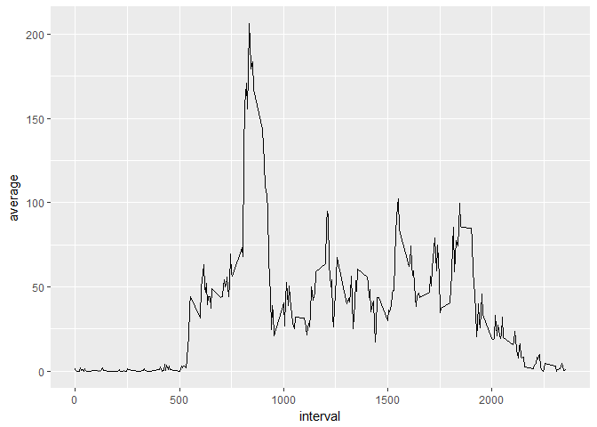
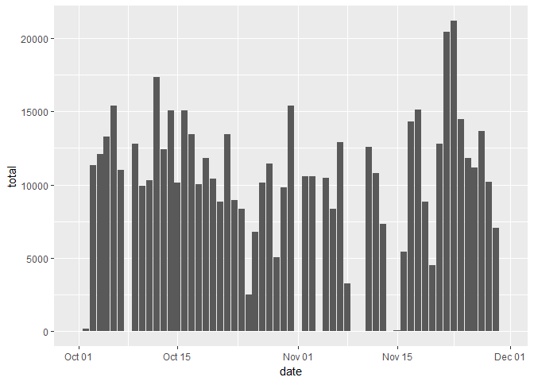

# Reproducible Research: Peer Assessment 1


## Loading and preprocessing the data

First, we will load all necessary libraries. Then, we'll read the data into a dataframe directly from the zip file:


```r
require(dplyr)
require(ggplot2)
require(lubridate)
```


```r
data <- read.csv(unz("activity.zip", "activity.csv"), stringsAsFactors = F)
```

We can see the general makeup of the data we'll be analyzing here:


```r
str(data)
```

```
## 'data.frame':	17568 obs. of  3 variables:
##  $ steps   : int  NA NA NA NA NA NA NA NA NA NA ...
##  $ date    : chr  "2012-10-01" "2012-10-01" "2012-10-01" "2012-10-01" ...
##  $ interval: int  0 5 10 15 20 25 30 35 40 45 ...
```

We'll make sure our "date" variable is of the class date, and continue onward:


```r
data$date <- ymd(data$date)
str(data)
```

```
## 'data.frame':	17568 obs. of  3 variables:
##  $ steps   : int  NA NA NA NA NA NA NA NA NA NA ...
##  $ date    : Date, format: "2012-10-01" "2012-10-01" ...
##  $ interval: int  0 5 10 15 20 25 30 35 40 45 ...
```

## What is mean total number of steps taken per day?

Noting that NA's can be ignored for now, we use the "dplyr" library to summarize the data by date:


```r
data2 <- data %>%
    group_by(date) %>%
    summarise(total=sum(steps, na.rm=T))
head(data2)
```

```
## # A tibble: 6 x 2
##         date total
##       <date> <int>
## 1 2012-10-01     0
## 2 2012-10-02   126
## 3 2012-10-03 11352
## 4 2012-10-04 12116
## 5 2012-10-05 13294
## 6 2012-10-06 15420
```

We'll plot these results as a histogram using ggplot2:


```r
ggplot(data2, aes(x=date, y=total)) +
    geom_histogram(stat="identity") +
    scale_x_date()
```

```
## Warning: Ignoring unknown parameters: binwidth, bins, pad
```

<!-- -->

We can do the same summary for `mean` and `median` as well:

```r
data3 <- data %>%
    group_by(date) %>%
    summarise(mean=mean(steps, na.rm=T))
head(data3)
```

```
## # A tibble: 6 x 2
##         date     mean
##       <date>    <dbl>
## 1 2012-10-01      NaN
## 2 2012-10-02  0.43750
## 3 2012-10-03 39.41667
## 4 2012-10-04 42.06944
## 5 2012-10-05 46.15972
## 6 2012-10-06 53.54167
```

```r
ggplot(data3, aes(x=date, y=mean)) +
    geom_histogram(stat="identity") +
    scale_x_date()
```

```
## Warning: Ignoring unknown parameters: binwidth, bins, pad
```

```
## Warning: Removed 8 rows containing missing values (position_stack).
```

<!-- -->

```r
data4 <- data %>%
    group_by(date) %>%
    summarise(median=median(steps, na.rm=T))
head(data4)
```

```
## # A tibble: 6 x 2
##         date median
##       <date>  <dbl>
## 1 2012-10-01     NA
## 2 2012-10-02      0
## 3 2012-10-03      0
## 4 2012-10-04      0
## 5 2012-10-05      0
## 6 2012-10-06      0
```

```r
ggplot(data4, aes(x=date, y=median)) +
    geom_histogram(stat="identity") +
    scale_x_date()
```

```
## Warning: Ignoring unknown parameters: binwidth, bins, pad

## Warning: Removed 8 rows containing missing values (position_stack).
```

<!-- -->

We can see that the median number of steps from all the samples is 0. This is due to the sheer number of 0's that are present in the interval samples. A summary helps elucidate this:


```r
summary(data$steps)
```

```
##    Min. 1st Qu.  Median    Mean 3rd Qu.    Max.    NA's 
##    0.00    0.00    0.00   37.38   12.00  806.00    2304
```

## What is the average daily activity pattern?

Now, we shall plot average daily activity by considering the interval ID as a marker for time of day, and averaging all step counts per ID to summarize the averaged amount of steps per time interval. 

We can start by using dplyr to summarize the data by interval:

```r
data5 <- data %>%
    group_by(interval) %>%
    summarize(average=mean(steps, na.rm=T))
head(data5)
```

```
## # A tibble: 6 x 2
##   interval   average
##      <int>     <dbl>
## 1        0 1.7169811
## 2        5 0.3396226
## 3       10 0.1320755
## 4       15 0.1509434
## 5       20 0.0754717
## 6       25 2.0943396
```

Next, we can graph this result as a time series line graph:


```r
ggplot(data5, aes(interval,average)) +
    geom_line()
```

<!-- -->

We notice a strong trend about a third of the way through the day! We can pinpoint this interval ID by filtering the dataframe by any values that match the maximum value:


```r
max_avg <- data5[data5$average == max(data5$average),]
max_avg
```

```
## # A tibble: 1 x 2
##   interval  average
##      <int>    <dbl>
## 1      835 206.1698
```

Looks to be interval 835, with an average of 206.1698113. We can see that value as a spike on our ggplot!

## Imputing missing values

Missing values are prevalent in the dataset, as we can see from a quick glance at the number of rows that feature them:


```r
sum(is.na(data$steps))
```

```
## [1] 2304
```

```r
sum(is.na(data$steps))/length(data$steps) # the Percentage of the total
```

```
## [1] 0.1311475
```

With this many missing values, we should create a way to estimate those values. Here's what we'll do:
- first, we'll create a logical vector noting which rows HAVE missing values
- next, we'll create the new dataframe that will contain the inserted values
- then, we'll run through the original data frame. If a value is missing, insert the daily average for that interval in its place (from the summary dataframe that already exists)


```r
missing <- is.na(data$steps) # logical vector
data_full <- data # new dataframe
for(ii in 1:length(missing)) {
    if(missing[ii]) {
        data_full$steps[ii] <- unlist(data5[data5$interval == data_full$interval[ii],"average"])
    }
}
```

Let's take a quick comparison look between our old and new dataframes:


```r
head(data)
```

```
##   steps       date interval
## 1    NA 2012-10-01        0
## 2    NA 2012-10-01        5
## 3    NA 2012-10-01       10
## 4    NA 2012-10-01       15
## 5    NA 2012-10-01       20
## 6    NA 2012-10-01       25
```

```r
head(data_full)
```

```
##       steps       date interval
## 1 1.7169811 2012-10-01        0
## 2 0.3396226 2012-10-01        5
## 3 0.1320755 2012-10-01       10
## 4 0.1509434 2012-10-01       15
## 5 0.0754717 2012-10-01       20
## 6 2.0943396 2012-10-01       25
```

```r
head(data5) # to make sure the right values were inserted!
```

```
## # A tibble: 6 x 2
##   interval   average
##      <int>     <dbl>
## 1        0 1.7169811
## 2        5 0.3396226
## 3       10 0.1320755
## 4       15 0.1509434
## 5       20 0.0754717
## 6       25 2.0943396
```

Now we can revisit our total, mean, and median steps summaries, as well as our daily averages:


```r
data_full2 <- data_full %>%
    group_by(date) %>%
    summarise(total=sum(steps, na.rm=T))

data_full3 <- data_full %>%
    group_by(date) %>%
    summarise(mean=mean(steps, na.rm=T))

data_full4 <- data_full %>%
    group_by(date) %>%
    summarise(median=median(steps, na.rm=T))

# Comparing each:
summary(data2)
```

```
##       date                total      
##  Min.   :2012-10-01   Min.   :    0  
##  1st Qu.:2012-10-16   1st Qu.: 6778  
##  Median :2012-10-31   Median :10395  
##  Mean   :2012-10-31   Mean   : 9354  
##  3rd Qu.:2012-11-15   3rd Qu.:12811  
##  Max.   :2012-11-30   Max.   :21194
```

```r
summary(data_full2)
```

```
##       date                total      
##  Min.   :2012-10-01   Min.   :   41  
##  1st Qu.:2012-10-16   1st Qu.: 9819  
##  Median :2012-10-31   Median :10766  
##  Mean   :2012-10-31   Mean   :10766  
##  3rd Qu.:2012-11-15   3rd Qu.:12811  
##  Max.   :2012-11-30   Max.   :21194
```

```r
summary(data3)
```

```
##       date                 mean        
##  Min.   :2012-10-01   Min.   : 0.1424  
##  1st Qu.:2012-10-16   1st Qu.:30.6979  
##  Median :2012-10-31   Median :37.3785  
##  Mean   :2012-10-31   Mean   :37.3826  
##  3rd Qu.:2012-11-15   3rd Qu.:46.1597  
##  Max.   :2012-11-30   Max.   :73.5903  
##                       NA's   :8
```

```r
summary(data_full3)
```

```
##       date                 mean        
##  Min.   :2012-10-01   Min.   : 0.1424  
##  1st Qu.:2012-10-16   1st Qu.:34.0938  
##  Median :2012-10-31   Median :37.3826  
##  Mean   :2012-10-31   Mean   :37.3826  
##  3rd Qu.:2012-11-15   3rd Qu.:44.4826  
##  Max.   :2012-11-30   Max.   :73.5903
```

```r
summary(data4)
```

```
##       date                median 
##  Min.   :2012-10-01   Min.   :0  
##  1st Qu.:2012-10-16   1st Qu.:0  
##  Median :2012-10-31   Median :0  
##  Mean   :2012-10-31   Mean   :0  
##  3rd Qu.:2012-11-15   3rd Qu.:0  
##  Max.   :2012-11-30   Max.   :0  
##                       NA's   :8
```

```r
summary(data_full4)
```

```
##       date                median      
##  Min.   :2012-10-01   Min.   : 0.000  
##  1st Qu.:2012-10-16   1st Qu.: 0.000  
##  Median :2012-10-31   Median : 0.000  
##  Mean   :2012-10-31   Mean   : 4.474  
##  3rd Qu.:2012-11-15   3rd Qu.: 0.000  
##  Max.   :2012-11-30   Max.   :34.113
```

```r
# And a graph of the sums:
ggplot(data2, aes(x=date, y=total)) +
    geom_histogram(stat="identity") +
    scale_x_date()
```

```
## Warning: Ignoring unknown parameters: binwidth, bins, pad
```

<!-- -->

```r
ggplot(data_full2, aes(x=date, y=total)) +
    geom_histogram(stat="identity") +
    scale_x_date()
```

```
## Warning: Ignoring unknown parameters: binwidth, bins, pad
```

<!-- -->

```r
# And finally, the daily averages:
data_full5 <- data_full %>%
    group_by(interval) %>%
    summarize(average=mean(steps, na.rm=T))

ggplot(data_full5, aes(interval,average)) +
    geom_line()
```

<!-- -->

Despite such a huge increase in some statistics (see how much Oct 1st, a date with all NAs, has increased in mean, median, and total steps!), most averaged statistics remain similar. This is especially true of the final graph (the daily average), because we're adding an average taken from this very graph! Imagine adding a math test score to a group of other math tests, in which the additional math test's score is exactly the average of the previous tests: the new average would be identical!

## Are there differences in activity patterns between weekdays and weekends?

Our last step will be to compare data from the Weekend and the Weekdays. As we noted earlier, our spike in activity occurred (on average) about a third of the way through the day, or roughly 8am. We can imagine that this activity largely reflects Weekday commuting, but why speculate?

- First, we'll loop through the data frame, and determine whether each date is a Weekend or Weekday. 
- Next, we'll save the results to a character vector, and assign that as a new Factor variable to our data frame. 
- Then we'll then be able to use this to analyze!


```r
wkdys <- character(0)
for(ii in 1:length(data_full$date)) {
    if(weekdays(data_full$date[ii]) %in% c("Saturday","Sunday")) {
        wkdys <- append(wkdys, "weekend")
    } else {
        wkdys <- append(wkdys, "weekday")
    }
}
data_full$week_part <- factor(wkdys, levels = c("weekday","weekend"))

ggplot(data_full, aes(interval,steps)) +
    geom_line(stat = "summary", fun.y = "mean") +
    facet_grid(week_part ~ .)
```

<!-- -->

As we see in the graphs, the spike at 835 is muted a bit, and the rest of the day features more of the day's steps. This helps paint a better picture of the variation in walking activity from day to day.
